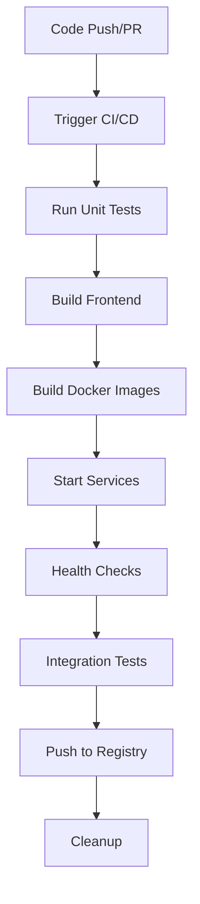

# FLEARN Testing Guide

This document describes the comprehensive testing setup for the FLEARN platform.

## 🧪 Test Suite Overview

The FLEARN project includes multiple layers of testing to ensure reliability and quality:

### 1. **Automated CI/CD Testing** (GitHub Actions)
- **Location**: `.github/workflows/docker-compose-ci.yml`
- **Triggers**: Push to main, Pull requests, Manual dispatch
- **Tests**:
  - Frontend linting (ESLint)
  - Frontend building (Next.js build)
  - Backend unit tests (Jest)
  - Docker image building with git integration
  - Service health checks
  - Database connectivity tests
  - API endpoint validation
  - Integration testing

### 2. **Local Testing Scripts** (`tests/` directory)
- **Integration Tests**: `tests/integration-test.sh` - Full stack testing
- **Workflow Tests**: `tests/workflow-test.sh` - CI/CD validation
- **Unit Tests**: `tests/unit-test.sh` - Component testing
- **Test Runner**: `run-tests.sh` - Main test orchestrator

### 3. **Backend Unit Testing**
- **Framework**: Jest + Supertest
- **Location**: `FLEARN-back/tests/`
- **Coverage**: Configuration validation, environment setup

## 🚀 Running Tests

### Main Test Runner (Recommended)
```bash
./run-tests.sh              # Run all tests
./run-tests.sh --quick      # Quick validation only
./run-tests.sh --integration # Integration tests only
./run-tests.sh --workflow   # Workflow validation only
./run-tests.sh --unit       # Unit tests only
```

### Individual Test Scripts
```bash
./tests/workflow-test.sh     # Workflow validation
./tests/integration-test.sh  # Full stack testing
./tests/unit-test.sh         # Unit tests
./tests/unit-test.sh --coverage # With coverage report
```

### Backend Unit Tests (Direct)
```bash
cd FLEARN-back
npm test
npm run test:coverage
```

## 📋 Test Categories

### ✅ **Automated Tests (CI/CD)**
1. **Code Quality**
   - ESLint linting for frontend
   - TypeScript compilation
   - Build process validation

2. **Integration Tests**
   - Docker container orchestration
   - Service-to-service communication
   - Database connectivity
   - API endpoint testing

3. **Health Checks**
   - Backend API health endpoint
   - Frontend application accessibility
   - Database connection validation
   - Service readiness verification

### ✅ **Local Development Tests**
1. **System Tests**
   - End-to-end application flow
   - Resource usage monitoring
   - Performance validation

2. **Configuration Tests**
   - Environment variable validation
   - Docker Compose syntax
   - Dockerfile optimization

## 🔧 Test Configuration

### Environment Variables (Testing)
The tests use safe default values for testing:
```bash
NODE_ENV=test
POSTGRES_PASSWORD=test_password
MONGO_PASSWORD=test_password
JWT_SECRET=test_jwt_secret_key
```

### Docker Configuration
- **Cache Busting**: Uses timestamps to ensure fresh builds
- **Health Checks**: Includes readiness probes for all services
- **Resource Limits**: Monitors memory and CPU usage

### CI/CD Security
- Production secrets are stored in GitHub Secrets
- Test environment uses safe default values
- No sensitive data in version control

## 📊 Test Results

### Success Criteria
- ✅ All containers start successfully
- ✅ Health endpoints return 200 OK
- ✅ Database connections established
- ✅ Frontend serves static content
- ✅ API endpoints respond correctly
- ✅ CORS configuration works
- ✅ Error handling functions properly

### Failure Handling
- **Automatic Cleanup**: Tests clean up resources on completion
- **Detailed Logging**: Comprehensive logs for debugging
- **Early Termination**: Tests stop on first critical failure
- **Resource Monitoring**: Prevents resource exhaustion

## 🔄 Continuous Integration Flow



## 🛠️ Troubleshooting

### Common Issues

1. **Port Conflicts**
   ```bash
   docker compose down -v  # Stop all services
   ./test.sh              # Restart tests
   ```

2. **Build Failures**
   ```bash
   docker system prune -f  # Clean Docker cache
   ./update.sh             # Fresh build with latest code
   ```

3. **Database Connection Issues**
   ```bash
   docker compose logs postgres  # Check PostgreSQL logs
   docker compose logs mongodb   # Check MongoDB logs
   ```

### Debug Mode
For detailed debugging, check individual service logs:
```bash
docker compose logs -f flearn-backend
docker compose logs -f flearn-frontend
docker compose logs -f postgres
docker compose logs -f mongodb
```

## 📈 Test Metrics

The testing suite tracks:
- **Test Coverage**: Percentage of code tested
- **Pass Rate**: Successful vs failed tests
- **Performance**: Build and startup times
- **Resource Usage**: Memory and CPU consumption
- **Reliability**: Consistency across runs

## 🔮 Future Enhancements

Planned testing improvements:
- [ ] E2E testing with Playwright/Cypress
- [ ] Load testing with k6
- [ ] Security scanning with OWASP ZAP
- [ ] Performance benchmarking
- [ ] Visual regression testing
- [ ] Mobile responsiveness testing

---

For questions about testing, please refer to the individual test scripts or check the GitHub Actions workflow logs.
