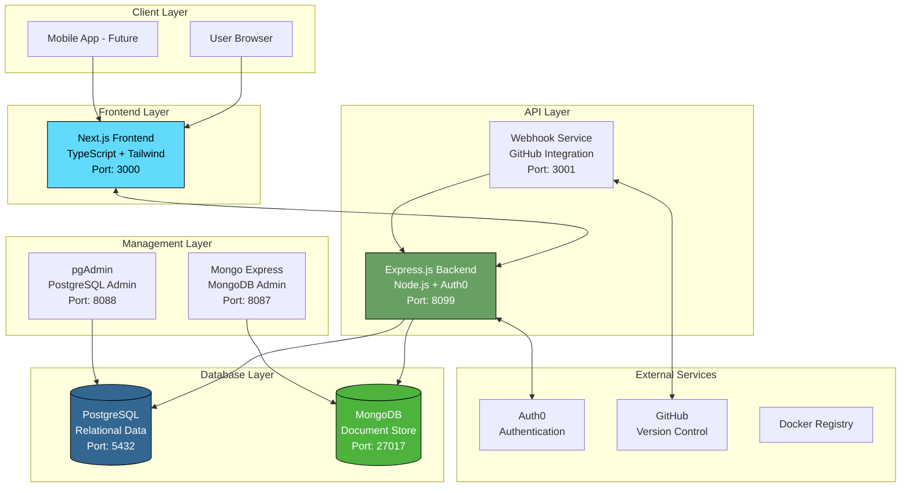
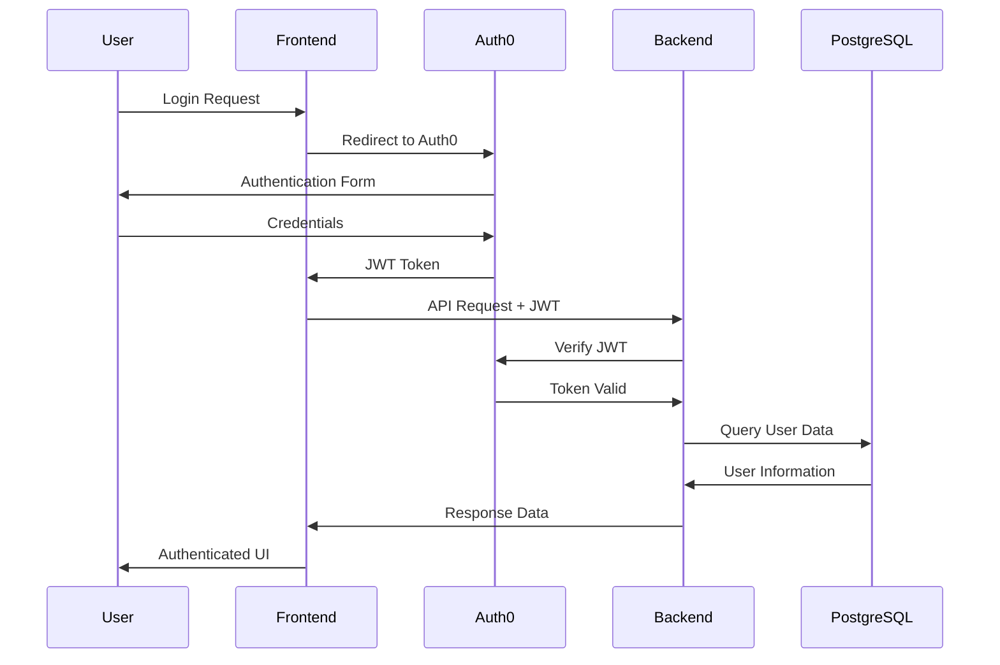
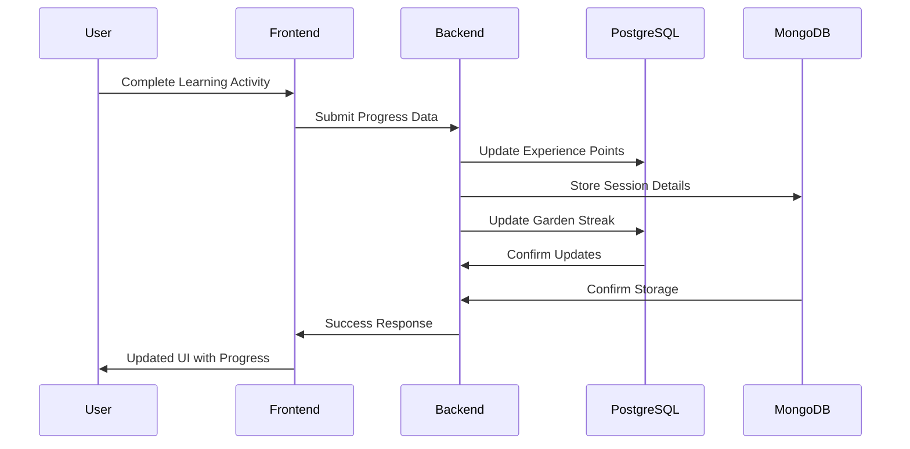

# 🏗️ FLEARN Architecture Documentation

This document provides a comprehensive overview of FLEARN's system architecture, technology stack, and design decisions.

## 🎯 Architecture Overview

FLEARN follows a **microservices architecture** with containerized services, designed for scalability, maintainability, and development efficiency.



## 🏛️ System Components

### Frontend Service (`flearn-frontend`)
**Technology**: Next.js 15.5.2 with TypeScript
- **Purpose**: User interface and experience
- **Features**: 
  - Server-side rendering (SSR)
  - Static site generation (SSG)
  - Responsive design with Tailwind CSS
  - TypeScript for type safety
  - Turbopack for fast development builds

**Key Features**:
```typescript
// Example component structure
interface UserProfile {
  userId: string;
  name: string;
  experiencePoints: ExperiencePoints;
  achievements: Achievement[];
}

interface ExperiencePoints {
  daily: number;
  math: number;
  physics: number;
  biology: number;
  chemistry: number;
}
```

### Backend API Service (`flearn-backend`)
**Technology**: Express.js with Node.js
- **Purpose**: Business logic and data management
- **Authentication**: Auth0 JWT integration
- **Database**: Dual database strategy (PostgreSQL + MongoDB)

**API Structure**:
```javascript
// Route organization
/api/
  ├── users/          # User management
  │   ├── profile     # GET, POST user profiles
  │   ├── preferences # GET, POST learning preferences  
  │   └── experience  # PATCH experience points
  ├── friends/        # Social features
  │   ├── /           # GET friends list
  │   ├── request     # POST friend requests
  │   └── /:id/status # PATCH accept/reject
  └── gardens/        # Learning progress
      ├── /           # GET, POST gardens
      ├── /:id/streak # PATCH update streaks
      └── /:id/status # PATCH garden status
```

### Webhook Service (`flearn-webhook`)
**Technology**: Express.js microservice
- **Purpose**: Automated deployment and CI/CD
- **Security**: HMAC SHA-256 signature verification
- **Features**:
  - Instant deployment on GitHub pushes
  - Container orchestration
  - Deployment logging and monitoring
  - Health check endpoints

### Database Architecture

#### PostgreSQL (Primary Relational Database)
**Purpose**: Structured data and relationships
```sql
-- Core schema structure
CREATE TABLE "user" (
    user_id UUID PRIMARY KEY,
    auth0_id VARCHAR UNIQUE NOT NULL,
    name VARCHAR(255),
    email VARCHAR(255),
    profile_pic TEXT,
    rank VARCHAR(50) DEFAULT 'Beginner',
    streak INTEGER DEFAULT 0,
    daily_exp INTEGER DEFAULT 0,
    math_exp INTEGER DEFAULT 0,
    phy_exp INTEGER DEFAULT 0,
    bio_exp INTEGER DEFAULT 0,
    chem_exp INTEGER DEFAULT 0,
    created_at TIMESTAMP DEFAULT NOW(),
    updated_at TIMESTAMP DEFAULT NOW()
);

CREATE TABLE "garden" (
    garden_id UUID PRIMARY KEY,
    user_id UUID REFERENCES "user"(user_id),
    name VARCHAR(255) NOT NULL,
    subject VARCHAR(100),
    streak INTEGER DEFAULT 0,
    status VARCHAR(50) DEFAULT 'active',
    created_at TIMESTAMP DEFAULT NOW()
);

CREATE TABLE "friend" (
    friend_id UUID PRIMARY KEY,
    user_id UUID REFERENCES "user"(user_id),
    friend_user_id UUID REFERENCES "user"(user_id),
    status VARCHAR(20) DEFAULT 'pending',
    created_at TIMESTAMP DEFAULT NOW()
);
```

#### MongoDB (Document Database)
**Purpose**: Flexible data structures and user-generated content
```javascript
// Example document structures
{
  // Learning sessions
  _id: ObjectId,
  userId: "uuid",
  sessionType: "practice|quiz|lesson",
  subject: "math|physics|biology|chemistry",
  content: {
    questions: [...],
    answers: [...],
    metadata: {...}
  },
  timestamp: Date,
  performance: {
    score: Number,
    timeSpent: Number,
    hintsUsed: Number
  }
}
```

## 🔧 Technology Stack Deep Dive

### Frontend Technologies
```json
{
  "framework": "Next.js 15.5.2",
  "language": "TypeScript",
  "styling": "Tailwind CSS 4.0",
  "bundler": "Turbopack",
  "linting": "ESLint",
  "package_manager": "npm"
}
```

**Key Libraries**:
- `@auth0/nextjs-auth0`: Authentication integration
- `axios`: HTTP client for API calls
- `framer-motion`: Animation library
- `react-hook-form`: Form management
- `@headlessui/react`: Accessible UI components

### Backend Technologies
```json
{
  "runtime": "Node.js",
  "framework": "Express.js",
  "language": "JavaScript (ES6+)",
  "authentication": "Auth0 JWT",
  "validation": "express-validator",
  "testing": "Jest + Supertest"
}
```

**Key Dependencies**:
- `express-jwt`: JWT middleware
- `jwks-rsa`: Auth0 key verification
- `pg`: PostgreSQL client
- `mongoose`: MongoDB ODM
- `cors`: Cross-origin resource sharing
- `helmet`: Security headers

### DevOps & Infrastructure
```yaml
containerization:
  platform: "Docker & Docker Compose"
  orchestration: "Docker Swarm (future: Kubernetes)"
  
deployment:
  strategy: "Webhook-based auto-deployment"
  ci_cd: "GitHub Actions"
  monitoring: "Custom logging + health checks"
  
databases:
  postgresql:
    version: "15"
    management: "pgAdmin 4"
  mongodb:
    version: "7.0"
    management: "Mongo Express"
```

## 🔄 Data Flow Architecture

### User Authentication Flow


### Learning Progress Flow


## 🏗️ Design Patterns & Principles

### Backend Architecture Patterns

#### 1. Repository Pattern
```javascript
// Database abstraction layer
class UserRepository {
    async findByAuth0Id(auth0Id) {
        const query = 'SELECT * FROM "user" WHERE auth0_id = $1';
        return await pgPool.query(query, [auth0Id]);
    }
    
    async updateExperience(userId, expData) {
        // Implementation
    }
}
```

#### 2. Middleware Pattern
```javascript
// Authentication middleware
const checkJwt = jwt({
    secret: jwksRsa.expressJwtSecret({
        cache: true,
        rateLimit: true,
        jwksRequestsPerMinute: 5,
        jwksUri: `https://${process.env.AUTH0_DOMAIN}/.well-known/jwks.json`
    }),
    audience: process.env.AUTH0_AUDIENCE,
    issuer: `https://${process.env.AUTH0_DOMAIN}/`,
    algorithms: ['RS256']
});
```

#### 3. Service Layer Pattern
```javascript
// Business logic separation
class ExperienceService {
    static calculateLevelFromExp(experience) {
        return Math.floor(Math.sqrt(experience / 100)) + 1;
    }
    
    static getRequiredExpForLevel(level) {
        return Math.pow(level - 1, 2) * 100;
    }
}
```

### Frontend Architecture Patterns

#### 1. Component-Based Architecture
```typescript
// Reusable component structure
interface ComponentProps {
  user: User;
  onUpdate: (data: UpdateData) => void;
}

export const UserProfile: React.FC<ComponentProps> = ({ user, onUpdate }) => {
  // Component implementation
};
```

#### 2. Custom Hooks Pattern
```typescript
// Reusable state logic
export const useAuth = () => {
  const { user, error, isLoading } = useUser();
  const router = useRouter();
  
  const login = () => router.push('/api/auth/login');
  const logout = () => router.push('/api/auth/logout');
  
  return { user, error, isLoading, login, logout };
};
```

## 🔒 Security Architecture

### Authentication & Authorization
- **Auth0 Integration**: Industry-standard OAuth 2.0 / OpenID Connect
- **JWT Tokens**: Stateless authentication with RS256 signing
- **RBAC**: Role-based access control (future implementation)
- **CORS**: Configured for specific origins only

### Data Security
- **Input Validation**: Server-side validation for all inputs
- **SQL Injection Prevention**: Parameterized queries
- **XSS Protection**: Content Security Policy headers
- **Rate Limiting**: API endpoint protection

### Infrastructure Security
- **Container Isolation**: Docker container security
- **Secrets Management**: Environment variables, no hardcoded secrets
- **HTTPS Enforcement**: TLS/SSL in production
- **Webhook Security**: HMAC signature verification

## 📈 Scalability Considerations

### Horizontal Scaling
- **Stateless Services**: No server-side session storage
- **Database Sharding**: Future MongoDB sharding strategy
- **Load Balancing**: Ready for multiple container instances
- **CDN Integration**: Static asset distribution

### Performance Optimization
- **Database Indexing**: Optimized query performance
- **Connection Pooling**: Efficient database connections
- **Caching Strategy**: Redis implementation planned
- **Image Optimization**: Next.js automatic image optimization

## 🔮 Future Architecture Plans

### Phase 2 Enhancements
- **Microservices Split**: Separate services for different domains
- **Event-Driven Architecture**: Message queues for async processing
- **Kubernetes Deployment**: Container orchestration upgrade
- **API Gateway**: Centralized API management

### Phase 3 Scalability
- **Multi-Region Deployment**: Global content distribution
- **Real-time Features**: WebSocket integration for live updates
- **ML/AI Integration**: Personalized learning recommendations
- **Mobile API**: Dedicated endpoints for mobile apps

---

This architecture is designed to be maintainable, scalable, and developer-friendly while following modern best practices for web application development.