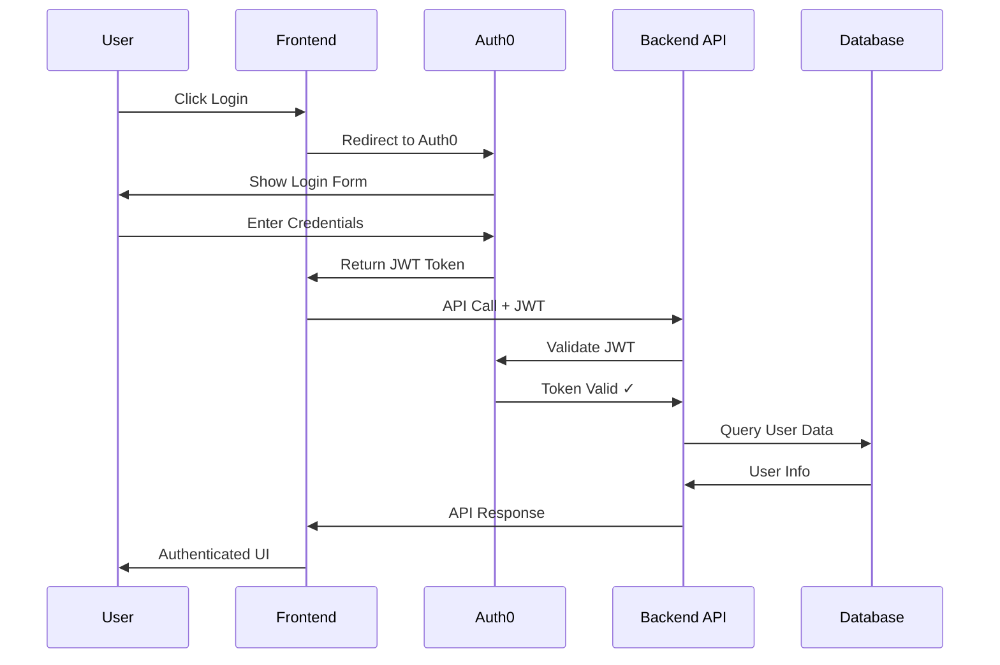

# 🔐 Authentication & Auth0 Integration

This comprehensive guide covers Auth0 setup for both backend API and frontend authentication in the FLEARN platform.

## 🎯 Overview

FLEARN uses **Auth0** as its identity provider to handle:
- **User Authentication**: Secure login/logout functionality
- **JWT Tokens**: Stateless authentication with RS256 signing
- **API Authorization**: Protected backend endpoints
- **Social Login**: Google, GitHub, and other provider integration
- **User Management**: Profile creation and management

## 🏗️ Authentication Architecture



## 🚀 Quick Setup Overview

1. **Auth0 Account Setup** - Create tenant and applications
2. **Backend Configuration** - API authentication middleware
3. **Frontend Integration** - Login/logout components
4. **Database Integration** - User profile synchronization
5. **Testing & Validation** - Comprehensive testing suite

---

## 📋 Part 1: Auth0 Account Setup

### Step 1: Create Auth0 Account
1. Visit [auth0.com](https://auth0.com) and sign up for free
2. Create a new tenant (e.g., `flearn-dev` for development)
3. Choose your region (closest to your users)
4. Complete the initial setup wizard

### Step 2: Create Applications

#### Frontend Application (Single Page Application)
1. Go to **Applications** → **Create Application**
2. **Name**: "FLEARN Frontend"
3. **Type**: "Single Page Web Applications"
4. **Technology**: Choose your framework (React, Next.js, etc.)

**Configuration Settings**:
```bash
# Application URIs
Allowed Callback URLs: 
http://localhost:[FRONTEND_PORT]/api/auth/callback,http://localhost:[FRONTEND_PORT]/callback

Allowed Logout URLs:
http://localhost:[FRONTEND_PORT]

Allowed Web Origins:
http://localhost:[FRONTEND_PORT]

Allowed Origins (CORS):
http://localhost:[FRONTEND_PORT]

# For production, add your production URLs
```

#### Backend API
1. Go to **APIs** → **Create API**
2. **Name**: "FLEARN API"
3. **Identifier**: `https://flearn-api.com` *(this becomes AUTH0_AUDIENCE)*
4. **Signing Algorithm**: RS256

### Step 3: Configure Social Connections (Optional)

#### Enable Google Login
1. Go to **Authentication** → **Social**
2. Click **Google** → Toggle **Enable**
3. Add your Google OAuth credentials:
   ```
   Client ID: your-google-client-id
   Client Secret: your-google-client-secret
   ```

#### Enable GitHub Login
1. Go to **Authentication** → **Social**  
2. Click **GitHub** → Toggle **Enable**
3. Add GitHub OAuth app credentials

### Step 4: Gather Auth0 Credentials

From your Auth0 dashboard, collect these values:

**Frontend Application**:
- Domain: `your-tenant.auth0.com`
- Client ID: `abc123xyz...`
- Client Secret: `def456uvw...` (if using Next.js)

**Backend API**:
- Domain: `your-tenant.auth0.com` (same as above)
- Audience: `https://flearn-api.com`

---

## 🔧 Part 2: Backend API Configuration

### Environment Variables

Add these to your `FLEARN-back/.env` file:

```env
# Auth0 Backend Configuration
AUTH0_DOMAIN=your-tenant.auth0.com
AUTH0_AUDIENCE=https://flearn-api.com

# Optional: For machine-to-machine authentication
AUTH0_CLIENT_ID=your_m2m_client_id
AUTH0_CLIENT_SECRET=your_m2m_client_secret
```

### JWT Middleware Setup

The FLEARN backend uses Express.js with JWT middleware:

```javascript
// middleware/auth.js
const jwt = require('express-jwt');
const jwksRsa = require('jwks-rsa');

// JWT validation middleware
const checkJwt = jwt({
  secret: jwksRsa.expressJwtSecret({
    cache: true,
    rateLimit: true,
    jwksRequestsPerMinute: 5,
    jwksUri: `https://${process.env.AUTH0_DOMAIN}/.well-known/jwks.json`
  }),
  audience: process.env.AUTH0_AUDIENCE,
  issuer: `https://${process.env.AUTH0_DOMAIN}/`,
  algorithms: ['RS256']
});

// Optional JWT middleware (allows unauthenticated requests)
const optionalJwt = jwt({
  secret: jwksRsa.expressJwtSecret({
    cache: true,
    rateLimit: true,
    jwksRequestsPerMinute: 5,
    jwksUri: `https://${process.env.AUTH0_DOMAIN}/.well-known/jwks.json`
  }),
  audience: process.env.AUTH0_AUDIENCE,
  issuer: `https://${process.env.AUTH0_DOMAIN}/`,
  algorithms: ['RS256'],
  credentialsRequired: false
});

module.exports = { checkJwt, optionalJwt };
```

### Protected Route Example

```javascript
// routes/users.js
const express = require('express');
const { checkJwt } = require('../middleware/auth');
const router = express.Router();

// Protected endpoint - requires valid JWT
router.get('/profile', checkJwt, async (req, res) => {
  try {
    const auth0Id = req.user.sub;  // Auth0 user ID from JWT
    const email = req.user.email;  // User email from JWT
    
    // Query user from database using auth0Id
    const user = await getUserByAuth0Id(auth0Id);
    
    if (!user) {
      return res.status(404).json({
        error: 'User not found',
        message: 'Please complete your profile setup'
      });
    }
    
    res.json({
      message: 'Profile retrieved successfully',
      user: user
    });
  } catch (error) {
    res.status(500).json({ error: 'Internal server error' });
  }
});

module.exports = router;
```

### Mock Authentication for Development

For development without Auth0:

```javascript
// middleware/auth.js - Development mode
const mockAuth = (req, res, next) => {
  if (process.env.NODE_ENV === 'development' && !process.env.AUTH0_DOMAIN) {
    req.user = {
      sub: 'auth0|mock-user-id',
      email: 'test@example.com',
      name: 'Test User'
    };
  }
  next();
};

const checkJwt = process.env.NODE_ENV === 'development' && !process.env.AUTH0_DOMAIN 
  ? mockAuth 
  : realJwtMiddleware;
```

---

## 🎨 Part 3: Frontend Integration

### Next.js Implementation

#### Installation
```bash
npm install @auth0/nextjs-auth0
```

#### Environment Configuration
Create `.env.local` in your Next.js project:

```env
# Auth0 Configuration for Next.js
AUTH0_SECRET='use-long-random-secret-key-minimum-32-chars'
AUTH0_BASE_URL='http://localhost:[FRONTEND_PORT]'
AUTH0_ISSUER_BASE_URL='https://YOUR-TENANT.auth0.com'
AUTH0_CLIENT_ID='your-frontend-client-id'
AUTH0_CLIENT_SECRET='your-frontend-client-secret'
AUTH0_AUDIENCE='https://flearn-api.com'

# API Configuration
NEXT_PUBLIC_API_BASE_URL='http://localhost:[API_PORT]'
```

> 🔒 **CRITICAL SECURITY WARNINGS**:
> - **NEVER commit** `.env` files with real values to version control
> - **Use strong secrets**: AUTH0_SECRET must be at least 32 characters
> - **Replace ALL** placeholder values with your actual Auth0 credentials
> - **Add** `.env*` to your `.gitignore` immediately
> - **Rotate secrets** regularly in production environments

#### Provider Setup
```jsx
// pages/_app.js
import { UserProvider } from '@auth0/nextjs-auth0/client';
import '../styles/globals.css';

export default function App({ Component, pageProps }) {
  return (
    <UserProvider>
      <Component {...pageProps} />
    </UserProvider>
  );
}
```

#### Auth0 API Route
```javascript
// pages/api/auth/[...auth0].js
import { handleAuth } from '@auth0/nextjs-auth0';

export default handleAuth();
```

### Login Component

```jsx
// components/LoginButton.js
import { useUser } from '@auth0/nextjs-auth0/client';
import { useRouter } from 'next/router';

export default function LoginButton() {
  const { user, error, isLoading } = useUser();
  const router = useRouter();

  if (isLoading) return <div className="loading">Loading...</div>;
  if (error) return <div className="error">Error: {error.message}</div>;

  if (user) {
    return (
      <div className="user-menu">
        
        <div className="user-info">
          <p className="user-name">{user.name}</p>
          <p className="user-email">{user.email}</p>
        </div>
        <button 
          onClick={() => router.push('/api/auth/logout')}
          className="logout-btn"
        >
          Logout
        </button>
      </div>
    );
  }

  return (
    <div className="login-section">
      <h1>Welcome to FLEARN 🌱</h1>
      <p>Your personal learning garden awaits!</p>
      <a href="/api/auth/login" className="login-btn">
        🔐 Sign In with Auth0
      </a>
    </div>
  );
}
```

### Protected Page Component

```jsx
// components/ProtectedRoute.js
import { useUser } from '@auth0/nextjs-auth0/client';
import { useRouter } from 'next/router';
import { useEffect } from 'react';

export default function ProtectedRoute({ children }) {
  const { user, error, isLoading } = useUser();
  const router = useRouter();

  useEffect(() => {
    if (!isLoading && !user) {
      router.push('/login');
    }
  }, [user, isLoading, router]);

  if (isLoading) {
    return (
      <div className="loading-page">
        <div className="spinner"></div>
        <p>Loading your learning garden...</p>
      </div>
    );
  }

  if (error) {
    return (
      <div className="error-page">
        <h2>Authentication Error</h2>
        <p>{error.message}</p>
        <a href="/api/auth/login" className="retry-btn">
          Try Again
        </a>
      </div>
    );
  }

  if (!user) {
    return null; // Will redirect to login
  }

  return children;
}
```

### Dashboard Page Example

```jsx
// pages/dashboard.js
import ProtectedRoute from '../components/ProtectedRoute';
import { useUser } from '@auth0/nextjs-auth0/client';
import { useState, useEffect } from 'react';

export default function Dashboard() {
  const { user } = useUser();
  const [userProfile, setUserProfile] = useState(null);
  const [loading, setLoading] = useState(true);

  useEffect(() => {
    fetchUserProfile();
  }, []);

  const fetchUserProfile = async () => {
    try {
      const response = await fetch('/api/flearn-proxy/users/profile');
      if (response.ok) {
        const data = await response.json();
        setUserProfile(data.user);
      }
    } catch (error) {
      console.error('Failed to fetch profile:', error);
    } finally {
      setLoading(false);
    }
  };

  return (
    <ProtectedRoute>
      <div className="dashboard">
        <header className="dashboard-header">
          <h1>Welcome back, {user.name}! 🎉</h1>
          <p>Ready to continue your learning journey?</p>
        </header>

        {loading ? (
          <div className="loading">Loading your profile...</div>
        ) : userProfile ? (
          <div className="profile-section">
            <h2>Your Learning Progress</h2>
            <div className="progress-cards">
              <div className="progress-card">
                <h3>Daily XP</h3>
                <p>{userProfile.daily_exp || 0}</p>
              </div>
              <div className="progress-card">
                <h3>Math XP</h3>
                <p>{userProfile.math_exp || 0}</p>
              </div>
              <div className="progress-card">
                <h3>Current Streak</h3>
                <p>{userProfile.streak || 0} days</p>
              </div>
            </div>
          </div>
        ) : (
          <div className="setup-profile">
            <h2>Complete Your Profile</h2>
            <p>Let's set up your learning preferences!</p>
            <button className="setup-btn">
              Setup Profile
            </button>
          </div>
        )}
      </div>
    </ProtectedRoute>
  );
}
```

---

## 🔗 Part 4: API Integration

### API Proxy for Client-Side Calls

```javascript
// pages/api/flearn-proxy/[...path].js
import { getAccessToken, withApiAuthRequired } from '@auth0/nextjs-auth0';

export default withApiAuthRequired(async function handler(req, res) {
  try {
    const { accessToken } = await getAccessToken(req, res);
    const { path } = req.query;
    const apiPath = Array.isArray(path) ? path.join('/') : path;
    
    const apiUrl = `${process.env.NEXT_PUBLIC_API_BASE_URL}/api/${apiPath}`;
    
    const response = await fetch(apiUrl, {
      method: req.method,
      headers: {
        'Authorization': `Bearer ${accessToken}`,
        'Content-Type': 'application/json',
      },
      body: req.method !== 'GET' ? JSON.stringify(req.body) : undefined,
    });

    const data = await response.json();
    
    if (!response.ok) {
      return res.status(response.status).json(data);
    }

    res.status(200).json(data);
  } catch (error) {
    console.error('API Proxy Error:', error);
    res.status(500).json({ error: 'Internal Server Error' });
  }
});
```

### API Utility Functions

```javascript
// lib/api.js
const API_BASE_URL = process.env.NEXT_PUBLIC_API_BASE_URL;

// Client-side API calls (goes through proxy)
export async function apiCall(endpoint, options = {}) {
  const url = `/api/flearn-proxy${endpoint}`;
  
  const response = await fetch(url, {
    ...options,
    headers: {
      'Content-Type': 'application/json',
      ...options.headers,
    },
  });

  if (!response.ok) {
    const error = await response.json();
    throw new Error(error.message || 'API call failed');
  }

  return await response.json();
}

// Server-side API calls (direct)
export async function serverApiCall(endpoint, accessToken, options = {}) {
  const url = `${API_BASE_URL}/api${endpoint}`;
  
  const response = await fetch(url, {
    ...options,
    headers: {
      'Authorization': `Bearer ${accessToken}`,
      'Content-Type': 'application/json',
      ...options.headers,
    },
  });

  if (!response.ok) {
    const error = await response.json();
    throw new Error(error.message || 'API call failed');
  }

  return await response.json();
}

// Custom hooks for common API calls
export function useUserProfile() {
  const [profile, setProfile] = useState(null);
  const [loading, setLoading] = useState(true);
  const [error, setError] = useState(null);

  useEffect(() => {
    async function fetchProfile() {
      try {
        const data = await apiCall('/users/profile');
        setProfile(data.user);
      } catch (err) {
        setError(err.message);
      } finally {
        setLoading(false);
      }
    }

    fetchProfile();
  }, []);

  return { profile, loading, error, refetch: fetchProfile };
}
```

---

## 🧪 Part 5: Testing & Validation

### Auth0 Test Scripts

The project includes comprehensive Auth0 testing scripts:

#### Start Test Environment
```bash
# Start complete Auth0 test environment
./scripts/start-auth0-test.sh
```

#### Test Auth0 Integration
```bash
# Test Auth0 domain and JWT validation
node ./scripts/test-auth0.js

# Test token generation and API calls
node ./scripts/test-auth0-token.js
```

#### Interactive Browser Testing
```bash
# Serve the interactive test page
python3 -m http.server 8080 --directory scripts/
# Then visit: http://localhost:[TEST_PORT]/auth0-test.html
```

### Manual Testing Checklist

- [ ] **Login Flow**: User can log in through Auth0
- [ ] **JWT Token**: Token is properly generated and included in requests
- [ ] **Protected Routes**: Unauthenticated users are redirected to login
- [ ] **API Calls**: Authenticated API requests work correctly
- [ ] **Logout**: User can log out and session is cleared
- [ ] **Token Refresh**: Expired tokens are handled gracefully
- [ ] **Error Handling**: Auth errors are displayed user-friendly
- [ ] **Profile Creation**: New users can create profiles
- [ ] **Cross-Origin**: CORS is configured correctly

### Common Test Scenarios

```javascript
// Test user profile creation
const testProfileCreation = async () => {
  const profileData = {
    name: "Test User",
    email: "test@example.com",
    edu_level: "High School",
    birthdate: "1995-01-01"
  };

  try {
    const response = await apiCall('/users/profile', {
      method: 'POST',
      body: JSON.stringify(profileData)
    });
    console.log('Profile created:', response);
  } catch (error) {
    console.error('Profile creation failed:', error);
  }
};

// Test friends functionality
const testFriendsSystem = async () => {
  try {
    // Get friends list
    const friends = await apiCall('/friends');
    
    // Send friend request
    const friendRequest = await apiCall('/friends/request', {
      method: 'POST',
      body: JSON.stringify({ friend_email: 'friend@example.com' })
    });
    
    console.log('Friends test completed:', { friends, friendRequest });
  } catch (error) {
    console.error('Friends test failed:', error);
  }
};
```

---

## 🔒 Security Best Practices

### JWT Token Security
- **Short Expiration**: Set reasonable token expiration times
- **Secure Storage**: Use httpOnly cookies for token storage (when possible)
- **HTTPS Only**: Always use HTTPS in production
- **Token Validation**: Always validate tokens on the server side

### Auth0 Configuration Security
- **Strong Secrets**: Use cryptographically strong secrets
- **Environment Variables**: Never commit secrets to version control
- **Callback URL Validation**: Strictly control allowed callback URLs
- **CORS Configuration**: Limit allowed origins to known domains

### API Security
- **Input Validation**: Validate all input data on the server
- **Rate Limiting**: Implement API rate limiting
- **SQL Injection Prevention**: Use parameterized queries
- **Authorization Checks**: Verify user permissions for each request

---

## 🐛 Troubleshooting Guide

### Common Auth0 Issues

#### "Invalid state parameter"
**Symptoms**: Login fails with state parameter error
**Solutions**:
- Clear browser localStorage and cookies
- Verify callback URLs in Auth0 dashboard
- Check for URL encoding issues

#### "Access denied. Invalid audience"
**Symptoms**: API calls return 401 Unauthorized
**Solutions**:
- Verify AUTH0_AUDIENCE matches API identifier
- Check API configuration in Auth0 dashboard
- Ensure frontend requests include audience parameter

#### "CORS error" 
**Symptoms**: Browser blocks API requests
**Solutions**:
- Add frontend URL to Auth0 allowed origins
- Configure backend CORS middleware
- Check for port mismatches between config and actual URLs

#### "Token expired"
**Symptoms**: API calls fail after some time
**Solutions**:
- Implement token refresh logic
- Handle 401 responses gracefully
- Redirect to login on token expiration

### Debug Tools

#### Enable Auth0 Debug Mode
```env
AUTH0_DEBUG=true
DEBUG=auth0:*
```

#### Check JWT Token Contents
```javascript
// Decode JWT token (client-side debugging only)
function decodeJWT(token) {
  const base64Url = token.split('.')[1];
  const base64 = base64Url.replace(/-/g, '+').replace(/_/g, '/');
  const jsonPayload = decodeURIComponent(atob(base64).split('').map(function(c) {
    return '%' + ('00' + c.charCodeAt(0).toString(16)).slice(-2);
  }).join(''));
  
  return JSON.parse(jsonPayload);
}

// Usage (only for debugging)
console.log('Token contents:', decodeJWT(accessToken));
```

#### Test Auth0 Endpoints
```bash
# Test Auth0 configuration endpoint
curl https://your-tenant.auth0.com/.well-known/openid_configuration

# Test JWKS endpoint  
curl https://your-tenant.auth0.com/.well-known/jwks.json

# Test token endpoint (with credentials)
curl -X POST https://your-tenant.auth0.com/oauth/token \
  -H "Content-Type: application/json" \
  -d '{
    "client_id": "YOUR_CLIENT_ID",
    "client_secret": "YOUR_CLIENT_SECRET", 
    "audience": "https://flearn-api.com",
    "grant_type": "client_credentials"
  }'
```

---

## 🎯 Next Steps

Once Auth0 is fully configured:

1. **User Onboarding**: Create smooth user profile setup flow
2. **Social Features**: Implement friends and leaderboard systems
3. **Advanced Security**: Add multi-factor authentication
4. **Analytics**: Track user authentication events
5. **Performance**: Optimize token refresh and caching
6. **Mobile**: Extend authentication to mobile apps

---

This comprehensive Auth0 integration provides secure, scalable authentication for the FLEARN platform while maintaining a smooth user experience.
