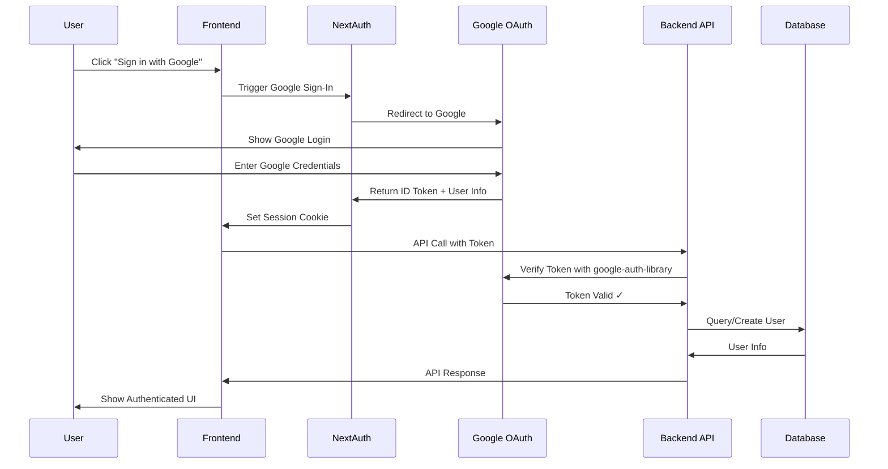

# 🔐 Authentication with Google OAuth

This comprehensive guide covers Google OAuth setup for both backend API and frontend authentication in the FLEARN platform using NextAuth.

## 🎯 Overview

FLEARN uses **Google OAuth 2.0** with **NextAuth** as its authentication provider to handle:
- **User Authentication**: Secure login/logout functionality via Google accounts
- **Session Management**: NextAuth handles secure session cookies
- **ID Tokens**: Google ID tokens verified on backend
- **User Profiles**: Automatic profile creation from Google account data
- **No Password Management**: Google handles all credential security

## 🏗️ Authentication Architecture


```mermaid
sequenceDiagram
    participant U as User
    participant F as Frontend
    participant N as NextAuth
    participant G as Google OAuth
    participant B as Backend API
    participant DB as Database
    
    U->>F: Click "Sign in with Google"
    F->>N: Trigger Google Sign-In
    N->>G: Redirect to Google
    G->>U: Show Google Login
    U->>G: Enter Google Credentials
    G->>N: Return ID Token + User Info
    N->>F: Set Session Cookie
    F->>B: API Call with Token
    B->>G: Verify Token with google-auth-library
    G->>B: Token Valid ✓
    B->>DB: Query/Create User
    DB->>B: User Info
    B->>F: API Response
    F->>U: Show Authenticated UI
```

## 🚀 Quick Setup Overview

1. **Google Cloud Setup** - Create OAuth 2.0 credentials
2. **Backend Configuration** - Token verification with google-auth-library
3. **Frontend Integration** - NextAuth provider setup
4. **Database Integration** - User profile creation and management
5. **Testing & Validation** - Comprehensive testing

---

## 📋 Part 1: Google Cloud Setup

### Step 1: Create Google Cloud Project

1. Visit [Google Cloud Console](https://console.cloud.google.com)
2. Sign in with your Google account
3. Click the project dropdown (top left) → **NEW PROJECT**
4. **Project name**: "FLEARN" or your preferred name
5. Click **CREATE**
6. Wait for project creation, then select your new project

### Step 2: Configure OAuth Consent Screen

1. Go to **APIs & Services** → **OAuth consent screen**
2. Choose user type:
   - **External**: For public apps (can add test users)
   - **Internal**: For Google Workspace organizations only
3. Click **CREATE**

4. **OAuth consent screen** tab:
   ```
   App name: FLEARN
   User support email: your-email@gmail.com
   App logo: (optional - upload your logo)
   Application home page: http://localhost:3000
   Application privacy policy: (optional for dev)
   Application terms of service: (optional for dev)
   Authorized domains: (leave empty for localhost)
   Developer contact information: your-email@gmail.com
   ```

5. Click **SAVE AND CONTINUE**

6. **Scopes** tab:
   - Click **ADD OR REMOVE SCOPES**
   - Select these scopes:
     * `.../auth/userinfo.email` - View your email address
     * `.../auth/userinfo.profile` - See your personal info
     * `openid` - Authenticate using OpenID Connect
   - Click **UPDATE** → **SAVE AND CONTINUE**

7. **Test users** tab (for External apps):
   - Click **+ ADD USERS**
   - Add email addresses that can test your app during development
   - Click **ADD** → **SAVE AND CONTINUE**

8. **Summary** tab:
   - Review your settings
   - Click **BACK TO DASHBOARD**

### Step 3: Create OAuth 2.0 Credentials

1. Go to **APIs & Services** → **Credentials**
2. Click **+ CREATE CREDENTIALS** → **OAuth client ID**

3. Configure OAuth client:
   ```
   Application type: Web application
   Name: FLEARN Web Client
   ```

4. **Authorized JavaScript origins**:
   ```
   http://localhost:3000
   http://localhost:8099
   ```

5. **Authorized redirect URIs**:
   ```
   http://localhost:3000/api/auth/callback/google
   ```

6. Click **CREATE**

7. **Important**: Copy your credentials:
   - **Client ID**: Looks like `123456789-abc...xyz.apps.googleusercontent.com`
   - **Client secret**: Looks like `GOCSPX-...`
   
   ⚠️ Save these securely! You'll need them for your `.env` files.

8. Click **OK**

### Step 4: Enable Required APIs (if needed)

Some Google APIs might need to be enabled:

1. Go to **APIs & Services** → **Library**
2. Search for and enable:
   - **Google+ API** (legacy, may not be needed)
   - **People API** (for profile info)

---

## 🔧 Part 2: Backend API Configuration

### Environment Variables

Add these to your `FLEARN-back/.env` file:

```env
# Google OAuth Configuration
GOOGLE_CLIENT_ID=your_client_id.apps.googleusercontent.com
GOOGLE_CLIENT_SECRET=GOCSPX-your_client_secret

# API Configuration
PORT=8099
NEXT_PUBLIC_API_BASE_URL=http://localhost:8099

# CORS - Allow frontend
ALLOWED_ORIGINS=http://localhost:3000,http://localhost:8099
```

### Token Verification Middleware

The backend uses `google-auth-library` to verify Google ID tokens:

```javascript
// middleware/auth.js (simplified example)
const { OAuth2Client } = require('google-auth-library');
const client = new OAuth2Client(process.env.GOOGLE_CLIENT_ID);

async function verifyGoogleToken(req, res, next) {
  try {
    // Extract token from Authorization header
    const authHeader = req.headers.authorization;
    if (!authHeader) {
      return res.status(401).json({ error: 'No authorization header' });
    }

    const token = authHeader.split(' ')[1]; // Remove 'Bearer '
    
    // Verify token with Google
    const ticket = await client.verifyIdToken({
      idToken: token,
      audience: process.env.GOOGLE_CLIENT_ID
    });

    const payload = ticket.getPayload();
    
    // Attach user info to request
    req.user = {
      id: payload['sub'],        // Google user ID
      email: payload['email'],
      name: payload['name'],
      picture: payload['picture']
    };

    next();
  } catch (error) {
    console.error('Token verification failed:', error);
    res.status(401).json({ error: 'Invalid token' });
  }
}

module.exports = { verifyGoogleToken };
```

### Protected Route Example

```javascript
// routes/users.js
const express = require('express');
const { verifyGoogleToken } = require('../middleware/auth');
const router = express.Router();

// Protected endpoint
router.get('/profile', verifyGoogleToken, async (req, res) => {
  try {
    const googleId = req.user.id;
    const email = req.user.email;
    
    // Check if user exists in database
    let user = await getUserByGoogleId(googleId);
    
    if (!user) {
      // Create new user from Google profile
      user = await createUser({
        google_id: googleId,
        email: email,
        name: req.user.name,
        profile_pic: req.user.picture
      });
    }
    
    res.json({
      message: 'Profile retrieved successfully',
      user: user
    });
  } catch (error) {
    console.error('Profile error:', error);
    res.status(500).json({ error: 'Internal server error' });
  }
});

module.exports = router;
```

---

## 🎨 Part 3: Frontend Integration with NextAuth

### Installation

```bash
cd FLEARN-front
npm install next-auth
```

### Environment Configuration

Create/edit `FLEARN-front/.env.local`:

```env
# NextAuth Configuration
NEXTAUTH_URL=http://localhost:3000
NEXTAUTH_SECRET=your_random_secret_here_min_32_chars

# Google OAuth Credentials
GOOGLE_CLIENT_ID=your_client_id.apps.googleusercontent.com
GOOGLE_CLIENT_SECRET=GOCSPX-your_client_secret

# Make Client ID available to frontend
NEXT_PUBLIC_GOOGLE_CLIENT_ID=your_client_id.apps.googleusercontent.com

# Backend API
NEXT_PUBLIC_API_BASE_URL=http://localhost:8099
```

> 🔒 **Generate NEXTAUTH_SECRET**:
> ```bash
> # On Linux/Mac:
> openssl rand -base64 32
> 
> # Or use any secure random string generator (minimum 32 characters)
> ```

### NextAuth Configuration

Create `FLEARN-front/src/app/api/auth/[...nextauth]/route.ts`:

```typescript
import NextAuth from "next-auth";
import GoogleProvider from "next-auth/providers/google";

const handler = NextAuth({
  providers: [
    GoogleProvider({
      clientId: process.env.GOOGLE_CLIENT_ID!,
      clientSecret: process.env.GOOGLE_CLIENT_SECRET!,
      authorization: {
        params: {
          prompt: "consent",
          access_type: "offline",
          response_type: "code"
        }
      }
    })
  ],
  callbacks: {
    async signIn({ user, account, profile }) {
      // Optional: Additional validation or user creation
      return true;
    },
    async session({ session, token }) {
      // Add extra data to session
      if (session.user) {
        session.user.id = token.sub;
      }
      return session;
    },
    async jwt({ token, account, profile }) {
      // Store extra data in JWT
      if (account) {
        token.accessToken = account.access_token;
        token.idToken = account.id_token;
      }
      return token;
    }
  },
  pages: {
    signIn: '/login',  // Custom sign-in page (optional)
    error: '/auth/error',  // Error page
  },
  session: {
    strategy: "jwt",
  },
});

export { handler as GET, handler as POST };
```

### Session Provider Setup

Wrap your app with SessionProvider in `FLEARN-front/src/app/layout.tsx`:

```typescript
import { SessionProvider } from "next-auth/react";

export default function RootLayout({
  children,
}: {
  children: React.ReactNode;
}) {
  return (
    <html lang="en">
      <body>
        <SessionProvider>
          {children}
        </SessionProvider>
      </body>
    </html>
  );
}
```

### Login Component

Create `FLEARN-front/src/components/LoginButton.tsx`:

```typescript
"use client";

import { signIn, signOut, useSession } from "next-auth/react";
import Image from "next/image";

export default function LoginButton() {
  const { data: session, status } = useSession();

  if (status === "loading") {
    return <div className="animate-pulse">Loading...</div>;
  }

  if (session?.user) {
    return (
      <div className="flex items-center gap-4">
        <Image
          src={session.user.image || "/default-avatar.png"}
          alt={session.user.name || "User"}
          width={40}
          height={40}
          className="rounded-full"
        />
        <div>
          <p className="font-semibold">{session.user.name}</p>
          <p className="text-sm text-gray-600">{session.user.email}</p>
        </div>
        <button
          onClick={() => signOut()}
          className="px-4 py-2 bg-red-500 text-white rounded hover:bg-red-600"
        >
          Sign Out
        </button>
      </div>
    );
  }

  return (
    <button
      onClick={() => signIn("google")}
      className="flex items-center gap-2 px-6 py-3 bg-white border border-gray-300 rounded-lg shadow hover:shadow-md transition"
    >
      <Image src="/google-icon.svg" alt="Google" width={20} height={20} />
      <span className="font-medium">Sign in with Google</span>
    </button>
  );
}
```

### Protected Page Example

Create `FLEARN-front/src/app/dashboard/page.tsx`:

```typescript
"use client";

import { useSession } from "next-auth/react";
import { useRouter } from "next/navigation";
import { useEffect } from "react";

export default function Dashboard() {
  const { data: session, status } = useSession();
  const router = useRouter();

  useEffect(() => {
    if (status === "unauthenticated") {
      router.push("/login");
    }
  }, [status, router]);

  if (status === "loading") {
    return (
      <div className="flex items-center justify-center min-h-screen">
        <div className="animate-spin rounded-full h-12 w-12 border-b-2 border-blue-500"></div>
      </div>
    );
  }

  if (!session) {
    return null;
  }

  return (
    <div className="container mx-auto p-8">
      <h1 className="text-3xl font-bold mb-4">
        Welcome, {session.user?.name}! 🎉
      </h1>
      <p className="text-gray-600">
        Email: {session.user?.email}
      </p>
      {/* Your dashboard content */}
    </div>
  );
}
```

### API Calls with Authentication

Create `FLEARN-front/src/lib/api.ts`:

```typescript
import { getSession } from "next-auth/react";

export async function apiCall(endpoint: string, options: RequestInit = {}) {
  const session = await getSession();
  
  if (!session?.user) {
    throw new Error("Not authenticated");
  }

  // Get ID token from session
  const token = session.idToken; // If you stored it in callbacks

  const response = await fetch(
    `${process.env.NEXT_PUBLIC_API_BASE_URL}${endpoint}`,
    {
      ...options,
      headers: {
        "Content-Type": "application/json",
        "Authorization": `Bearer ${token}`,
        ...options.headers,
      },
    }
  );

  if (!response.ok) {
    throw new Error(`API call failed: ${response.statusText}`);
  }

  return await response.json();
}

// Example usage:
export async function getUserProfile() {
  return apiCall("/api/users/profile");
}

export async function updateExperience(data: { daily_exp: number; math_exp: number }) {
  return apiCall("/api/users/experience", {
    method: "PATCH",
    body: JSON.stringify(data),
  });
}
```

---

## 🧪 Part 4: Testing & Validation

### Local Testing Checklist

- [ ] **Google OAuth configured** in Google Cloud Console
- [ ] **Redirect URIs match** exactly (http://localhost:3000/api/auth/callback/google)
- [ ] **Environment variables set** in both frontend and backend
- [ ] **Frontend starts** successfully on port 3000
- [ ] **Backend starts** successfully on port 8099
- [ ] **"Sign in with Google" button** appears on your login page
- [ ] **Clicking button** redirects to Google login
- [ ] **After login** redirects back to your app
- [ ] **User session** is created and accessible
- [ ] **API calls work** with authenticated session
- [ ] **Sign out** clears session properly

### Manual Testing Steps

1. **Start Backend**:
   ```bash
   cd FLEARN-back
   npm run dev
   ```

2. **Start Frontend**:
   ```bash
   cd FLEARN-front
   npm run dev
   ```

3. **Test Authentication Flow**:
   - Go to http://localhost:3000
   - Click "Sign in with Google"
   - Log in with a Google account (use test user if needed)
   - Verify you're redirected back
   - Check that user info displays correctly

4. **Test API Integration**:
   - Open browser DevTools → Network tab
   - Trigger an API call (e.g., fetch profile)
   - Verify Authorization header is present
   - Check backend logs for successful token verification

### Debug Tips

#### View Session Data
```typescript
// In any client component
import { useSession } from "next-auth/react";

export default function DebugSession() {
  const { data: session } = useSession();
  
  return (
    <pre className="bg-gray-100 p-4 rounded">
      {JSON.stringify(session, null, 2)}
    </pre>
  );
}
```

#### Backend Token Verification
```javascript
// Add logging to middleware
console.log('Token:', token.substring(0, 20) + '...');
console.log('Payload:', payload);
```

---

## 🐛 Troubleshooting

### Common Issues

#### 1. "Redirect URI Mismatch"
**Symptoms**: Error after clicking "Sign in with Google"
**Solutions**:
- Verify redirect URI in Google Cloud Console **exactly** matches: `http://localhost:3000/api/auth/callback/google`
- No trailing slashes
- Check for typos
- Ensure correct protocol (http vs https)

#### 2. "Invalid Client" Error
**Symptoms**: Authentication fails
**Solutions**:
- Verify `GOOGLE_CLIENT_ID` and `GOOGLE_CLIENT_SECRET` are correct
- Check environment variables are loaded (restart dev servers)
- Ensure OAuth consent screen is configured

#### 3. Session Not Persisting
**Symptoms**: User appears logged out after refresh
**Solutions**:
- Verify `NEXTAUTH_SECRET` is set and consistent
- Check `NEXTAUTH_URL` matches your frontend URL
- Clear browser cookies and try again

#### 4. Backend Can't Verify Token
**Symptoms**: 401 Unauthorized from API
**Solutions**:
- Ensure backend has correct `GOOGLE_CLIENT_ID`
- Check token is being sent in Authorization header
- Verify `google-auth-library` is installed in backend

#### 5. "Access Blocked" by Google
**Symptoms**: Can't test with certain accounts
**Solutions**:
- Add test users in OAuth consent screen
- Or publish app (review process for production)
- Check app isn't blocked by Google

---

## 🔒 Security Best Practices

### Client ID & Secret Management
- 🔒 **NEVER commit** `.env` files with real secrets
- 🔒 **Rotate secrets** every 90 days in production
- 🔒 **Use different credentials** for dev/staging/prod
- 🔒 **Enable 2FA** on your Google account
- 🔒 **Monitor OAuth logs** in Google Cloud Console

### Session Security
- ✅ Use strong `NEXTAUTH_SECRET` (32+ characters)
- ✅ Set secure cookie options in production
- ✅ Implement session timeout
- ✅ Clear sessions on logout
- ✅ Validate sessions server-side

### Token Security
- ✅ Always verify tokens server-side
- ✅ Never expose ID tokens in client logs
- ✅ Use HTTPS in production
- ✅ Implement rate limiting
- ✅ Handle token expiration gracefully

---

## 📚 Additional Resources

- **NextAuth.js Docs**: https://next-auth.js.org/
- **Google OAuth 2.0**: https://developers.google.com/identity/protocols/oauth2
- **google-auth-library**: https://github.com/googleapis/google-auth-library-nodejs
- **Google Cloud Console**: https://console.cloud.google.com/

---

## 🎯 Next Steps

Once Google OAuth is fully configured:

1. **User Profile Creation**: Automatically create profiles from Google data
2. **Role-Based Access**: Implement admin/user roles
3. **Additional Scopes**: Request more permissions if needed
4. **Production Deployment**: Update redirect URIs for production domain
5. **Analytics**: Track authentication events
6. **Mobile Apps**: Extend to mobile OAuth flows

---

This comprehensive Google OAuth integration provides secure, user-friendly authentication for the FLEARN platform while leveraging Google's robust security infrastructure.
